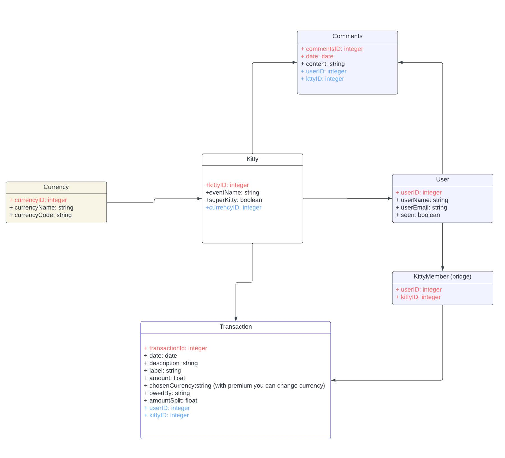

# Kitty-Split-Prototype

A console-based prototype for managing shared expense groups ("Kitties"), built to validate core business logic and database design before full application development. Originally developed as a university course assignment.

---

## Database Design

The relational schema was designed to support flexible expense splitting across multiple users and groups, implemented using Entity Framework Core with a SQLite backend.

### Core Tables

- **Kitty** — Represents an expense group with an `EventName`, a currency reference (`CurrencyID`), and a `SuperKitty` flag that unlocks premium features such as multi-currency transactions.
- **User** — Stores user details (`UserName`, `UserEmail`) and a `Seen` boolean to track whether a user has logged into the app.
- **KittyMember** — A bridge table enabling a many-to-many relationship between users and kitties, using a composite primary key of `KittyID` and `UserID`. A single user can belong to multiple groups and vice versa.
- **Transaction** — Records each expense or payment with fields for `Amount`, `AmountSplit`, `Label` (e.g., Expense, Money Given), `Description`, `OwedBy`, `Date`, and `ChosenCurrency` for per-transaction currency selection in Super Kitties.
- **Comment** — Allows users to leave timestamped messages (`CreatedAt`) within a kitty, linked via foreign keys to both the `User` and `Kitty` tables.
- **Currency** — A lookup table storing `CurrencyName` and `CurrencyCode` (ISO codes), referenced by the `Kitty` table.

### Key Design Decisions

- The `AmountSplit` field on `Transaction` means each split generates its own row, making per-person balances straightforward to query without application-level calculation.
- The `OwedBy` field tracks debt direction at the row level, supporting both equal and custom splits.
- Separating `Currency` into its own table (rather than storing it as a string on `Kitty`) ensures data consistency and makes it easy to extend supported currencies.

---

## Features

### Kitty Creation
Users can create a new expense group by specifying an event name and selecting a currency. The kitty is persisted in the SQLite database and immediately available for adding members and transactions.

### User Login and Navigation
The app supports switching between kitties and logging in as different users. On login, the user's `Seen` flag is updated to `true`, providing a simple mechanism to track which users have engaged with the app.

### Transaction Management
Transactions can be added with different labels (Expense, Money Given, etc.) and support multiple splitting methods. Depending on the split type, the system generates the appropriate number of rows in the `Transaction` table. Users can also upgrade a kitty to "Super Kitty" status, enabling multi-currency support within a single group.

### Comments
Users can post comments within a kitty group, each stored with a `CreatedAt` timestamp and linked to the authoring user.

### Overview and Display
The app provides views for listing expenses, reading comments, and displaying a financial overview of the group, including per-user balances and a summary of the kitty's overall financial state.

---

## Tech Stack

- **C#** (.NET console application)
- **Entity Framework Core** (ORM)
- **SQLite** (relational database, via `mydatabase.db`)

---

## Project Structure

| File | Purpose |
|---|---|
| `main.cs` | Entry point — bootstraps kitty creation and the start screen |
| `Entities.cs` | EF Core entity models for all database tables |
| `KittySplitDbContext.cs` | DbContext configuration, relationships, and SQLite connection |
| `AddKitty.cs` | Logic for creating a new expense group |
| `AddExpense.cs` | Logic for adding and splitting transactions |
| `AddComment.cs` | Logic for posting comments to a kitty |
| `ShowTransactions.cs` | Logic for displaying expenses and financial overview |
| `StartScreen.cs` | Navigation and user login flow |
| `HelperClass.cs` | Shared utility methods |
| `Migrations/` | EF Core database migration history |

---

## Purpose

This prototype was built to validate the data model and business logic for a shared-expense application, with a focus on getting the database relationships and splitting logic right before investing in a full UI. It served as a proof of concept that the schema could handle real-world scenarios like unequal splits, multi-currency groups, and multi-user collaboration.
